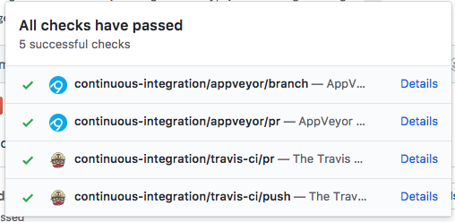

| **`Linux and Mac OS`** | **`Windows OS`** | **`Module Version`** | **`Coverage`**|
|-----------------|---------------------|------------------|------------------|
|[](https://travis-ci.org/linwoodc3/gdeltPyR)|[](https://ci.appveyor.com/project/linwoodc3/gdeltpyr/history)|[](https://badge.fury.io/py/gdelt)|[](https://coveralls.io/github/linwoodc3/gdeltPyR?branch=master)|


# gdeltPyR
gdeltPyR is a Python-based framework to access and analyze [Global Database of Events, Language, and Tone (GDELT) 1.0 or 2.0](http://gdeltproject.org/data.html) data in a Python Pandas or R dataframe. A user can enter a single date, date range (list of two strings), or individual dates (more than two in a list) and return a [tidy data set ready for scientific or data-driven exploration](http://vita.had.co.nz/papers/tidy-data.pdf).  

`gdeltPyR` retrieves [GDELT data, version 1.0 or version 2.0](http://gdeltproject.org/data.html#intro) via [parallel HTTP GET requests](http://docs.python-requests.org/en/v0.10.6/user/advanced/#asynchronous-requests) and will provide a method to [access GDELT data directly via Google BigQuery ](http://gdeltproject.org/data.html#googlebigquery). Therefore, the more cores you have, the less time it takes to pull more data.  Moreover, the more RAM you have, the more data you can pull.  And finally, for RAM-limited workflows, create a pipeline that pulls data, writes to disk, and flushes.  

The GDELT Project advertises as the largest, most comprehensive, and highest resolution open database of human society ever created. It monitors print, broadcast, and web news media in over 100 languages from across every country in the world to keep continually updated on breaking developments anywhere on the planet. Its historical archives stretch back to January 1, 1979 and accesses the world’s breaking events and reaction in near-realtime as both the GDELT Event and Global Knowledge Graph update every 15 minutes.  Visit the [GDELT website to learn more about the project](http://gdeltproject.org/#intro).

### *GDELT Facts*

* GDELT 1.0 is a daily dataset 
     *  1.0 only has 'events' and 'gkg' tables
     *  1.0 posts the previous day's data at 6AM EST of next day (i.e. Monday's data will be available 6AM Tuesday EST)
* GDELT 2.0 is updated every 15 minutes
     *  Some time intervals can have missing data; `gdeltPyR` provides a warning for missing data  
     *  2.0 has 'events','gkg', and 'mentions' tables
     *  2.0 has a distinction between native english and translated-to-english news
     *  2.0 has more columns


## Project Concept and Evolution Plan

This project will evolve in [two phases](https://github.com/linwoodc3/gdeltPyR/projects). Moreover, if you want to contribute to the project, this section can help prioritize where to put efforts.  
> Phase 1 focuses on providing consistent, stable, and reliable access to GDELT data.

`gdeltPyR` will help data scientists, researchers, data enthusiasts, and curious Python coders in this phase.  Therefore, most [issues](https://github.com/linwoodc3/gdeltPyR/issues) in this phase will build out the main [`Search` method of the `gdelt` class](https://github.com/linwoodc3/gdeltPyR/blob/master/gdelt/base.py#L181-L690) to return [GDELT data, version 1.0 or version 2.0](http://gdeltproject.org/data.html#intro), or equally important, give a relevant error message when no data is returned.  This also means the project will focus on building documentation, a unit testing framework (shooting for 90% coverage), and creating a helper class that provides helpful information on column names/table descriptions.  

> Phase 2 brings analytics to `gdeltPyR` to expand the library beyond a simple data retrieval functionality

This phase is what will make `gdeltPyR` useful to a wider audience. The major addition will be an `Analysis` method of the `gdelt` class which will analyze outputs of the `Search` method.  For data-literate users (data scientists, researchers, students, data journalists, etc), enhancements in this phase will save time by providing summary statistics and extraction methods of GDELT data, and as a result reduce the time a user would spend writing code to perform routine data cleanup/analysis.  For the non-technical audience (students, journalists, business managers, etc.), enhancesments in this phase will provide outputs that summarize GDELT data, which can in turn be used in reports, articles, etc.  Areas of focus include descriptive statistics (mean, split-apply-combine stats, etc), spatial analysis, and time series.


## New Features (0.1.10)

1.  Added geodataframe output; can be easily converted into a shapefile or [choropleth](https://en.wikipedia.org/wiki/Choropleth_map) visualization.
2.  Added continuous integration testing for Windows, OSX, and Linux (Ubuntu)
3.  Normalized columns output; export data with SQL ready columns (no special characters, all lowercase)
4.  Choosing between the native-english or translated-to-english datasets from GDELT v2.

```python
import gdelt

gd= gdelt.gdelt(version=2)

events = gd.Search(['2017 May 23'],table='events',output='gpd',normcols=True,coverage=False)

```

## Coming Soon (version 0.1.11, as of 29 May 2017)


*  Query Google's BigQuery directly from `gdeltPyR` using the `pandas.io.gbq` interface; requires authentication and Google Compute account
* Adding a query for [GDELT Visual Knowledge Graph (VGKG)](http://blog.gdeltproject.org/gdelt-visual-knowledge-graph-vgkg-v1-0-available/)
* Adding a query for [GDELT American Television Global Knowledge Graph (TV-GKG)](http://blog.gdeltproject.org/announcing-the-american-television-global-knowledge-graph-tv-gkg/)

<p align="center">
  
</p>


### Installation


`gdeltPyR` can be installed via pip

```bash
pip install gdelt
```

### Basic Examples

**GDELT 1.0 Queries**
```python
import gdelt

# Version 1 queries
gd1 = gdelt.gdelt(version=1)

# pull single day, gkg table
results= gd1.Search('2016 Nov 01',table='gkg')
print(len(results))

# pull events table, range, output to json format
results = gd1.Search(['2016 Oct 31','2016 Nov 2'],coverage=True,table='events')
print(len(results))
```
**GDELT 2.0 Queries**
```python
# Version 2 queries
gd2 = gdelt.gdelt(version=2)

# Single 15 minute interval pull, output to json format with mentions table
results = gd2.Search('2016 Nov 1',table='mentions',output='json')
print(len(results))

# Full day pull, output to pandas dataframe, events table
results = gd2.Search(['2016 11 01'],table='events',coverage=True)
print(len(results))


```
## Output Options

`gdeltPyR` can output results directly into several formats which include:
*  pandas dataframe
*  csv
*  json
*  geopandas dataframe *(as of version 0.1.10)*
*  GeoJSON *(coming soon version 0.1.11)*
*  Shapefile *(coming soon version 0.1.11)*


Performance on 4 core, MacOS Sierra 10.12 with 16GB of RAM:
* 900,000 by 61 (rows x columns) pandas dataframe returned in 36 seconds
    * data is a merged pandas dataframe of GDELT 2.0 events database data

## `gdeltPyR` Parameters
`gdeltPyR` provides access to 1.0 and 2.0 data.  Six parameters guide the query syntax:

| **Name**    | Description                                                                                                                                                                                                                                                       | Input Possibilities/Examples    |
|-------------|-------------------------------------------------------------------------------------------------------------------------------------------------------------------------------------------------------------------------------------------------------------------|---------------------------------|
| version     | (integer)  - Selects the version of GDELT data to query; defaults to version 2.                                                                                                                                                                                   | 1 or 2                          |
| date        | (string or list of strings) - Dates to query                                                                                                                                                                                                                      | "2016 10 23" or "2016 Oct 23"   |
| coverage    | (bool) - For GDELT 2.0, pulls every 15 minute interval in the dates passed in the 'date' parameter. Default coverage is False or None.  `gdeltPyR` will pull the latest 15 minute interval for the current day or the last 15 minute interval for a historic day. | True or False or None           |
| translation | (bool) - For GDELT 2.0, if the english or translated-to-english dataset should be downloaded                                                                                                                                                                      | True or False                   |
| tables      | (string) - The specific GDELT table to pull.  The default table is the 'events' table.  See the [GDELT documentation page for more information](http://gdeltproject.org/data.html#documentation)                                                                  | 'events' or 'mentions' or 'gkg' |
| output      | (string) - The output type for the results                                                                 | 'json' or 'csv' or 'gpd' |

These parameter values can be mixed and matched to return the data you want.  the `coverage` parameter is used with GDELT version 2; when set to "True", the `gdeltPyR` will query all available 15 minute intervals for the dates passed.  For the current day, the query will return the most recent 15 minute interval. 
  
  
## Known Issues

*  **"Running out of memory; need to cover wider timeframe"**
    *  **Fix 1**: Use Google BigQuery Method in `gdeltPyR` (coming soon)
        *  **Why**:  Drastically reduces the memory footprint as all processing is pushed to server side; returns subset of GDELT data but requires SQL familiarity
    *  **Fix 2**: Use Version 1 data
        *  **Why**:  Version 2 has more fields of data so consumes more memory. Version 1 has less fields.  Visit [the GDELT data page to learn about `Version 1` and `Version 2` differences](http://gdeltproject.org/data.html)
    *  **Fix 3**: Get more memory or write to disk, flush RAM, then continue iterating until done. 
        *  **Why**:  If you **MUST** use `Version 2` and pull full days of data, you need more memory as the gdeltPyR return is held in memory.  One day of GDELT `Version 2` data can be 500 MB. Get more RAM, you have less problems. Or, pull a day, write to disk, flush, then continue. 

## Coming Soon

* Query [Google BigQuery copy of GDELT directly](https://bigquery.cloud.google.com/table/gdelt-bq:full.events) from `gdeltPyR`; will require project ID and authentication using `pandas gbq` inteface.
* Adding a query for [GDELT Visual Knowledge Graph (VGKG)](http://blog.gdeltproject.org/gdelt-visual-knowledge-graph-vgkg-v1-0-available/)
* Adding a query for [GDELT American Television Global Knowledge Graph (TV-GKG)](http://blog.gdeltproject.org/announcing-the-american-television-global-knowledge-graph-tv-gkg/)


# Contributing to gdeltPyR

All contributions, bug reports, bug fixes, documentation improvements, enhancements and ideas are welcome.

A detailed overview on how to contribute is forthcoming.

Our main requirement (and advice) is to make sure you write a unit test for your enhancement or addition (or just make one to help get the project to 90% unit tests!!!).  Moreover, we can't accept a commit until existing unittests are passing in Travis CI (OSX and Linux) and Appveyor (Windows).  

If you are simply looking to start working with the `gdeltPyR` codebase, navigate to the [gdeltPyR's Issues](https://github.com/linwoodc3/gdeltPyR/issues) tab and start looking through interesting issues. There are a number of issues listed where you could start out.

Or maybe through using `gdeltPyR` you have an idea of your own or are looking for something in the documentation and thinking ‘this can be improved’...you can do something about it!

## `gdeltPyR` Dev Environment

We follow the [pandas](https://pandas.pydata.org/pandas-docs/stable/contributing.html#getting-started-with-git) instructions as a guide to build a `gdeltPyR` development environment. Windows users [should look at the instructions below for environment set up.](#windows_environment)  

An easy way to create a `gdeltPyR` development environment is as follows.

* Install either [Anaconda](https://www.continuum.io/downloads) or [miniconda](https://conda.io/miniconda.html)
* Make sure that you have [cloned the repository](https://github.com/linwoodc3/gdeltPyR/)
* cd to the `gdeltPyR` source directory

After completing all steps above, tell conda to create a new environment, named `gdelt_dev`, or any other name you would like for this environment, by running:


* For Python 2.7 
```bash
 conda create -n gdelt_dev python=2 -c conda-forge --file travis/requirements_all.txt

```

* For Python 3.5 
```bash
 conda create -n gdelt_dev python=3 -c conda-forge --file travis/requirements_all.txt
```

* For Python 3.6
```bash
 conda create -n gdelt_dev python=3.6 -c conda-forge --file travis/requirements_all36.txt
```

<h3> <a id="windows_environment"></a>Windows Dev Environment</h3>

For Windows, we will again follow the `pandas` documentation (let me know if this doesn't work for `gdeltPyR`).  To build on Windows, you need to have compilers installed to build the extensions. You will need to install the appropriate Visual Studio compilers, VS 2008 for Python 2.7, VS 2010 for 3.4, and VS 2015 for Python 3.5 and 3.6.

For Python 2.7, you can install the mingw compiler which will work equivalently to VS 2008:

```bash
conda install -n gdelt_dev libpython
```

or use the Microsoft Visual Studio VC++ compiler for Python. Note that you have to check the x64 box to install the x64 extension building capability as this is not installed by default.

For Python 3.4, you can download and install the Windows 7.1 SDK. Read the references below as there may be various gotchas during the installation.

For Python 3.5 and 3.6, you can download and install the Visual Studio 2015 Community Edition.

Here are some references and blogs:

* https://blogs.msdn.microsoft.com/pythonengineering/2016/04/11/unable-to-find-vcvarsall-bat/
* https://github.com/conda/conda-recipes/wiki/Building-from-Source-on-Windows-32-bit-and-64-bit
* https://cowboyprogrammer.org/building-python-wheels-for-windows/
* https://blog.ionelmc.ro/2014/12/21/compiling-python-extensions-on-windows/
* https://support.enthought.com/hc/en-us/articles/204469260-Building-Python-extensions-with-Canopy

This will create the new environment, and not touch any of your existing environments, **nor any existing Python installation**. It will install all of the basic dependencies of `gdeltPyR`, as well as the development and testing tools. To enter this new environment:

* On Windows
```bash
activate gdelt_dev
```

* On Linux/Mac OS
```bash
source activate gdelt_dev
```

You will then see a confirmation message to indicate you are in the new development environment.

To view your environments:

```bash
conda info -e
```

To return to your home root environment in Windows:
```bash
deactivate
```
To return to your home root environment in OSX / Linux:

```bash
source deactivate
```

## Building `gdeltPyR`

See the [full conda docs here](http://conda.pydata.org/docs).

The last step is installing the gdelt development source into this new directory. First, make sure that you cd into the gdeltPyR source directory.  You have two options to build the code:

1.  The best way to develop 'gdeltPyR' is to build the extensions in-place by running:

```bash
python setup.py build_ext --inplace
```

If you startup the Python interpreter in the pandas source directory you will call the built C extensions

2.  Another very common option is to do a develop install of pandas:

```bash
python setup.py develop
```

This makes a symbolic link that tells the Python interpreter to import pandas from your development directory. Thus, you can always be using the development version on your system without being inside the clone directory.

You should have a fully functional development environment!

## Continuous Integration

`pandas` has a fantastic write up on Continuous Integration (CI).  Because `gdeltPyR` embraces the same CI concepts, please [read `pandas` introduction and explanation of CI if you have issues](https://pandas.pydata.org/pandas-docs/stable/contributing.html#testing-with-continuous-integration). All builds of your branch or Pull Request should pass with `greens` before it can be merged with the master branch.



## Committing Your Code

There's no point in reinventing the wheel; [read the `pandas` documentation on committing code for instructions](https://pandas.pydata.org/pandas-docs/stable/contributing.html#contributing-your-changes-to-pandas) on how to contribute to `gdeltPyR`.

If you completed everything above, you should be ready to contribute.  


## Styles for Submitting Issues/Pull Requests

We follow the [`pandas`](https://pandas.pydata.org/pandas-docs/stable/contributing.html#contributing-your-changes-to-pandas)  coding style for issues and pull requests.  Use the following style:

* ENH: Enhancement, new functionality
* BUG: Bug fix
* DOC: Additions/updates to documentation
* TST: Additions/updates to tests
* BLD: Updates to the build process/scripts
* PERF: Performance improvement
* CLN: Code cleanup


See [this issue as an example](https://github.com/linwoodc3/gdeltPyR/issues/8).